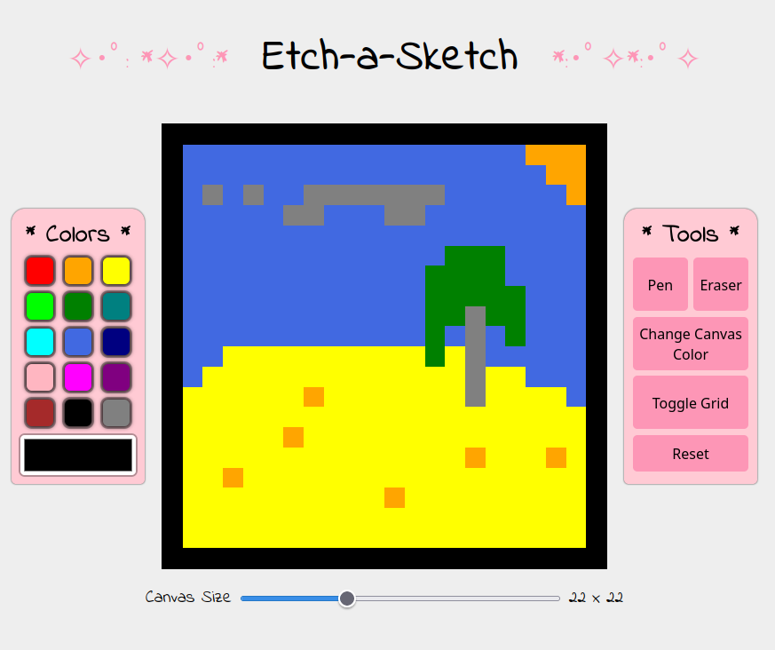

# etch-a-sketch
Etch-a-sketch project made for The Odin Project. I'm quite happy with how this turned out! I felt motivated knowing I was making a little game.

I ended up making it not responsive partially because I wasn't sure how this game would work on mobile devices.

The project used a lot of DOM manipulation and event listeners so I would say it was a good learning experience.

<h2>Screenshot</h2>

